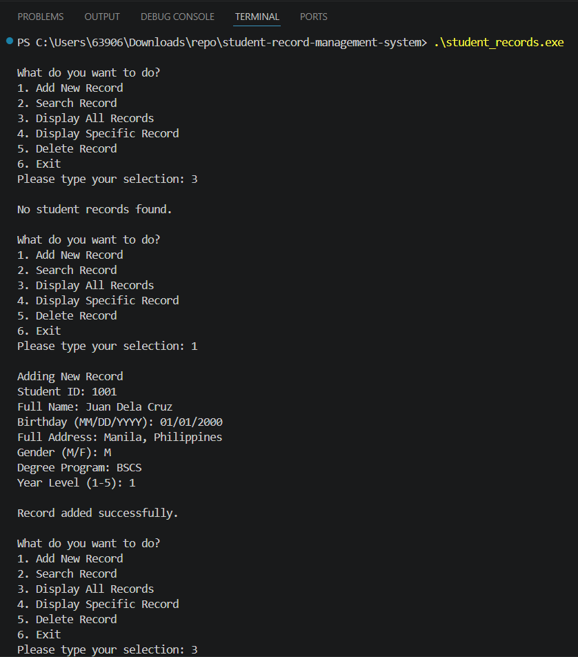
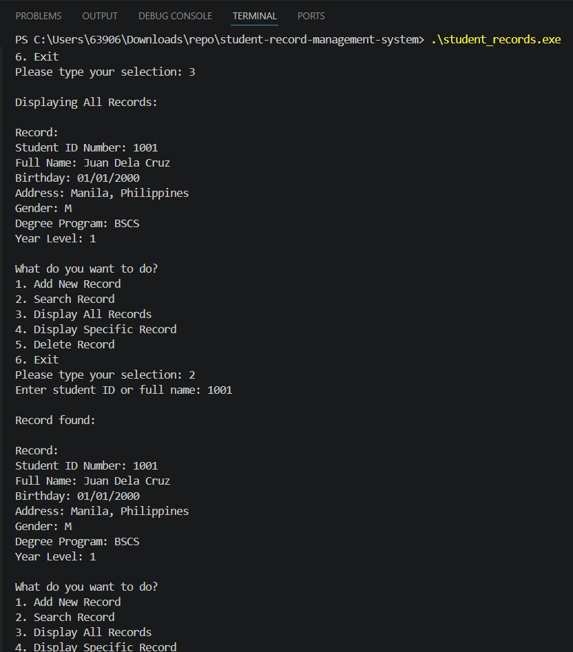
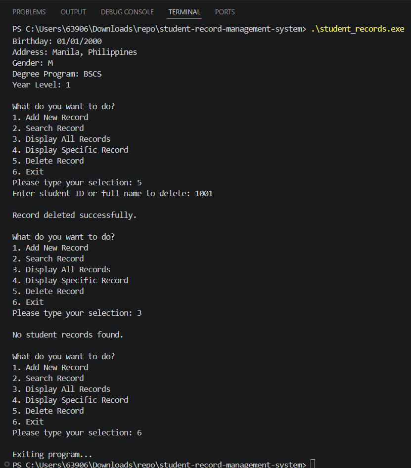

# Student Record Management System in C++

A C++ console-based student record management system for adding, searching, displaying, and deleting student information using a menu-driven interface.

## Features

- Add new student records
- Search for a student by ID or full name
- Display all student records
- Display a specific student record
- Delete student records
- Prevent duplicate student IDs
- Validate user input
- Handle empty record lists
- Menu-driven console interface

## Student Information Stored

Each student record includes:

- Student ID
- Full name
- Birthday
- Address
- Gender
- Degree program
- Year level

## Technologies Used

- C++
- C++ Standard Library
- Vector
- Console-based input and output

## Project Structure

```text
cpp-student-record-management-system/
├── .gitignore
├── README.md
├── assets/
│   ├── sample-output.png
│   ├── sample-output2.png
│   └── sample-output3.png
└── student_record_system.cpp
```

## How to Run

### Clone the Repository

```bash
git clone https://github.com/TimNieto/cpp-student-record-management-system.git
cd cpp-student-record-management-system
```

### Compile

For Windows PowerShell:

```powershell
g++ .\student_record_system.cpp -o .\student_records.exe
```

For macOS or Linux:

```bash
g++ student_record_system.cpp -o student_records
```

### Run

For Windows PowerShell:

```powershell
.\student_records.exe
```

For macOS or Linux:

```bash
./student_records
```

## Sample Output







## How It Works

After running the program, the user can choose from the menu options to add, search, display, or delete student records.

The program stores records temporarily while it is running. Once the program is closed, the records are not saved permanently.

## Future Improvements

- Add file handling to save and load student records
- Add an option to update existing student records
- Add sorting by student ID or name
- Add case-insensitive search
- Improve the user interface
- Organize the program using classes

## License

This project is for educational and portfolio purposes only. All rights are reserved.

You may view the source code, but you may not copy, modify, distribute, or use this code without permission from the author.

## Author

Created by Tim Nieto.
